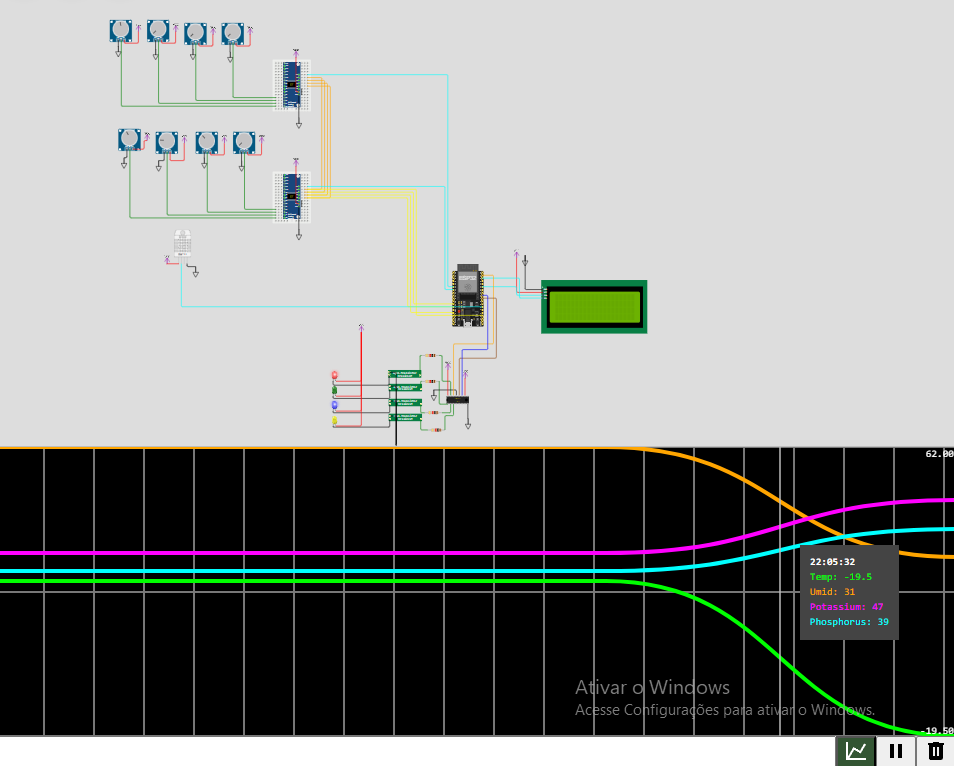

# activity-fiap-ai-p4a1

> **Note:**  
> This repository is part of the **Artificial Intelligence** course at [FIAP](https://github.com/fiap) - Online 2024. It contains the activity titled *"Chapter 1 - Automation and Intelligence in the FarmTech Solution"* from Phase 4.

This repository contains a solution for optimizing irrigation and nutrient management through predictive intelligence and real-time monitoring. It incorporates Scikit-learn for predictive modeling, Streamlit for interactive dashboards, and ESP32 for field hardware integration. Enhancements include a refined database architecture, embedded systems optimization, and an intuitive user interface for smarter farming.

## Features

- **Database**: PostgreSQL for efficient data storage and querying.  
- **Interactive Dashboard**: Real-time data visualization with Streamlit.  
- **ESP32 Integration**: Communication with field hardware for data collection and irrigation control. For further information, check [ESP32](document/other/esp32.md).
- **Predictive Modeling**: Machine learning models using Scikit-learn for irrigation recommendations. For more information, access [ML Training](document/other/ml_training.md).

## Observations

- AI Modeling is not integrated

### Key Improvements

### 1. **Database Enhancements**  
   - Transitioned to **PostgreSQL** for improved data handling.  
   - Revised schema to store historical data like soil moisture and nutrient levels.  
   - Standardized column and table naming conventions.  

### 2. **Streamlit Dashboard**  
   - Enhanced interactivity and data visualization.  
   - Dynamic charts for real-time monitoring of soil metrics.  
   - Integrated insights from machine learning models.

### 3. **ESP32 and Hardware Integration**  
   - Optimized sensor integration and memory usage.  
   - Connected ESP32 to a **Wokwi simulation** for real-time data transmission via MQTT.  
   - Added an LCD display (I2C protocol) to show critical metrics (e.g., soil moisture, nutrient levels).  
   - Implemented real-time monitoring with Serial Plotter for variable tracking.  

### 4. **Predictive Modeling**  
   - Created a predictive irrigation model using Scikit-learn.  
   - Recommendations based on historical soil and nutrient data.  
   - Enabled actionable insights for efficient water management.

## Demonstrations and Evidence

### **Serial Plotter Integration**

Below is a screenshot of the Serial Plotter showcasing variable tracking (e.g., soil moisture) in real time:

  
*The image shows a simulated electronic circuit diagram with various interconnected components, including sensors, a microcontroller, an LCD display, and an array of graphical outputs below. Multiple temperature and humidity sensors are connected in parallel, feeding data into a ESP32 board, which appears to process and relay the information to the LCD screen. The graphical interface at the bottom displays time-series data for parameters such as temperature, humidity, potassium, and phosphorus levels. The chart includes colored lines representing trends for each parameter over time. Additionally, there is a live tooltip showing the current readings for temperature (-19.5°C), humidity (31%), potassium (47), and phosphorus (39), along with the time stamp "22:05:32."*

### **Video Demonstration**  
A demonstration video showing the updated system in action is available on YouTube (unlisted): [Watch the Video](https://youtube.com/your-video-link)

## Installation

### Prerequisites

Ensure the following tools are installed on your system:

- [Git](https://git-scm.com/downloads)  
- [Docker](https://docs.docker.com/)  
- [Docker Compose](https://docs.docker.com/compose/)  
- [Python 3.x](https://www.python.org/)  
- [VS Code](https://code.visualstudio.com/download) (Optional: [SQLTools](https://marketplace.visualstudio.com/items?itemName=mtxr.sqltools))  

### Clone the Repository

```bash
git clone https://github.com/luisfuturist/activity-fiap-ai-p4a1.git
cd activity-fiap-ai-p4a1/
```

## Setup

1. **Database Setup (PostgreSQL)**:
   - Start the database:
    ```bash
    docker compose up -d
    ```
    - Stop the database:
    ```bash
    docker compose down
    ```

2. **Create and Activate a Virtual Environment**:
   ```sh
   python3 -m venv .venv
   source .venv/bin/activate  # On Windows, use `.venv\Scripts\activate`
   ```

3. **Install dependencies**:
   ```bash
   pip install -r requirements.txt
   ```

4. **Populate database**:
   ```bash
   python scripts/init_db.py
   ```

## Running the Solutions

### 1. **Application**  
   Start the app:
   ```bash
   streamlit run src/streamlit_app.py
   ```

### 2. **MQTT Data Loading**  
   Start the data loader for the application:
   ```bash
   streamlit run src/app.py
   ```

### 3. **ESP32 Integration**  
   - Access the Wokwi project: [Wokwi Project](https://wokwi.com/projects/415998871219053569)  
   - The ESP32 code is located in the `Platformio/` folder.  
   - Metrics are displayed on the LCD screen, and Serial Plotter monitors real-time variable changes.

## Project Management

Access the [GitHub Project](https://github.com/users/luisfuturist/projects/4).

## Members (Group 60)

- [Amandha Nery](https://www.linkedin.com/in/amandhanery/) (RM560030)
- [Bruno Conterato](https://www.linkedin.com/in/brunoconterato/) (RM561048)
- [Gustavo Castro](https://www.linkedin.com/in/gustavo-castro-29a78a2a/) (RM560831)
- [Kild Fernandes](https://www.linkedin.com/in/kild-fernandes/) (RM560615)
- [Luis Emidio](https://www.linkedin.com/in/luisfuturist/) (RM559976)

## Professors

- **Tutor**: [Lucas Gomes Moreira](https://www.linkedin.com/in/lucas-gomes-moreira-15a8452a/)
- **Coordinator**: [André Godoi](https://www.linkedin.com/in/profandregodoi/)

## License

This project is licensed under the [Creative Commons Attribution 4.0 International](http://creativecommons.org/licenses/by/4.0/?ref=chooser-v1).
