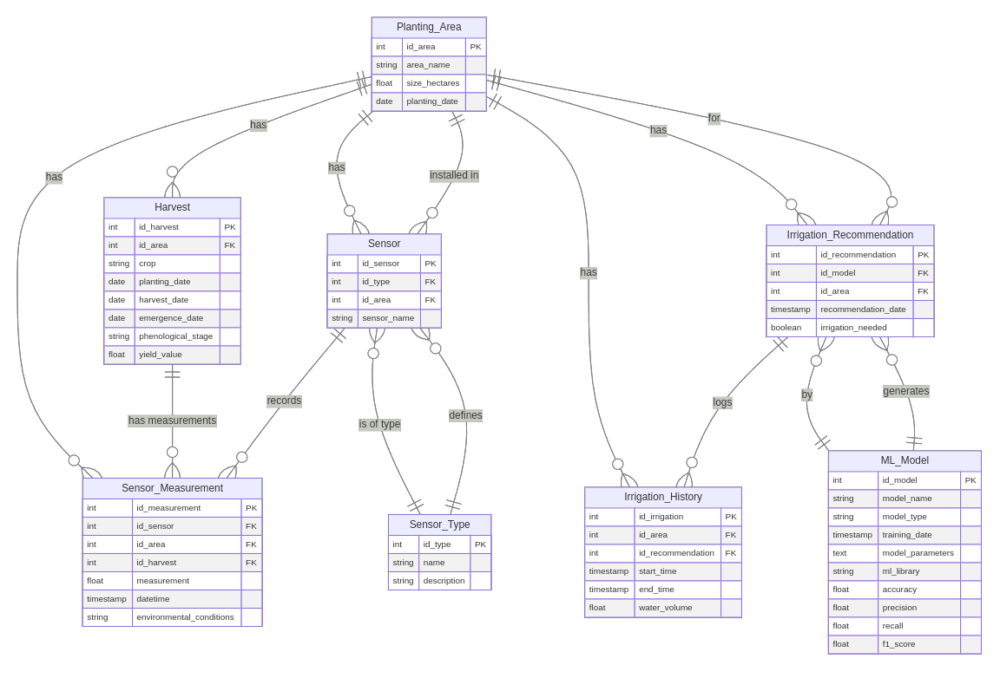

# FarmTech Database Setup

Este projeto utiliza **Python**, **PostgreSQL** e **SQLAlchemy** para gerenciar a base de dados de monitoramento agrícola. Siga as instruções abaixo para configurar o ambiente e inicializar o banco de dados.

---

## **Índice**
- [Pré-requisitos](#pré-requisitos)
- [Passo 1: Criar e Ativar um Ambiente Virtual](#passo-1-criar-e-ativar-um-ambiente-virtual)
- [Passo 2: Instalar Dependências](#passo-2-instalar-dependências)
- [Passo 3: Configurar e Inicializar o Banco de Dados](#passo-3-configurar-e-inicializar-o-banco-de-dados)
- [Passo 4: Inicializar o Banco de Dados](#passo-4-inicializar-o-banco-de-dados)
- [Modelagem Entidade-Relacionamento (MER) - FarmTech Database](#modelagem-entidade-relacionamento-mer---farmtech-database)
- [Problemas Comuns](#problemas-comuns)
- [Contribuindo](#contribuindo)
- [Licença](#licença)

---

## **Pré-requisitos**

1. **Python 3.8 ou superior**  
   Certifique-se de que o Python está instalado em sua máquina. [Baixe aqui](https://www.python.org/downloads/).

2. **PostgreSQL**  
   Instale o PostgreSQL em sua máquina. [Instruções de instalação](https://www.postgresql.org/download/).

3. **Pip**  
   O `pip` é o gerenciador de pacotes do Python. Ele vem instalado com o Python, mas você pode atualizá-lo com:
   ```bash
   python -m pip install --upgrade pip
   ```

---

## **Passo 1: Criar e Ativar um Ambiente Virtual**

O ambiente virtual (**venv**) isola as dependências do projeto, evitando conflitos com outras aplicações.

### **Criar o ambiente virtual**
```bash
python -m venv venv
```

### **Ativar o ambiente virtual**
- **Windows**:
  ```bash
  venv\Scripts\activate
  ```
- **Linux/Mac**:
  ```bash
  source venv/bin/activate
  ```

Se ativado com sucesso, o terminal mostrará o nome do ambiente virtual antes do prompt:
```bash
(venv) $
```

---

## **Passo 2: Instalar Dependências**

Com o ambiente virtual ativado, instale as dependências do projeto listadas no arquivo `requirements.txt`.

### **Instalar as dependências**
```bash
pip install -r requirements.txt
```

### **Arquivo `requirements.txt`**
Certifique-se de que o arquivo contém as bibliotecas necessárias:
```
psycopg2-binary
sqlalchemy
```

---

## **Passo 3: Configurar e Inicializar o Banco de Dados**

### **Configurar o PostgreSQL**
Certifique-se de que o PostgreSQL está em execução e crie um banco de dados chamado `fiap_p4a1`. Você pode usar o cliente de linha de comando `psql` ou uma ferramenta GUI como o **pgAdmin**.

### **Criar o banco de dados**
1. Acesse o PostgreSQL com seu usuário:
   ```bash
   psql -U postgres
   ```
2. Crie o banco de dados:
   ```sql
   CREATE DATABASE fiap_p4a1;
   ```
3. Crie o usuário e configure a senha:
   ```sql
   CREATE USER fiap_p4a1 WITH PASSWORD 'fiap_p4a1';
   GRANT ALL PRIVILEGES ON DATABASE fiap_p4a1 TO fiap_p4a1;
   ```

---

## **Passo 4: Inicializar o Banco de Dados**

Com o PostgreSQL configurado, execute o script Python para criar as tabelas e inserir os dados iniciais.

### **Executar o script**
```bash
python scripts/init_db.py
```

Se tudo ocorrer corretamente, a saída será:
```
Database and tables created, initial data added successfully.
```

---

## Modelagem Entidade-Relacionamento (MER) - FarmTech Database

Esta é a modelagem das entidades e seus relacionamentos para o banco de dados utilizado no sistema de monitoramento agrícola.

### **Entidades e Relacionamentos**

### **1. `AreaPlantio`** (Área de Plantio)
A tabela **`AreaPlantio`** representa as diferentes áreas de plantio monitoradas.

**Atributos:**
- `id` (PK): Identificador único da área
- `nome_area`: Nome da área de plantio
- `tamanho_hectares`: Tamanho da área em hectares
- `cultura`: Tipo de cultura plantada na área
- `data_plantio`: Data de plantio da cultura

**Relacionamentos:**
- Um **`AreaPlantio`** pode ter vários **`Sensor`** associados.
- Um **`AreaPlantio`** pode ter várias **`MedicaoSensor`** associadas.
- Um **`AreaPlantio`** pode ter várias **`RecomendacaoIrrigacao`** associadas.
- Um **`AreaPlantio`** pode ter várias **`HistoricoIrrigacao`** associadas.

---

### **2. `TipoSensor`** (Tipo de Sensor)
A tabela **`TipoSensor`** armazena os tipos de sensores disponíveis.

**Atributos:**
- `id` (PK): Identificador único do tipo de sensor
- `nome`: Nome do tipo de sensor (ex: Umidade, pH, K, P)
- `descricao`: Descrição do sensor

**Relacionamentos:**
- Um **`TipoSensor`** pode ter vários **`Sensor`** associados.

---

### **3. `Sensor`** (Sensor)
A tabela **`Sensor`** representa sensores instalados em áreas de plantio para realizar medições.

**Atributos:**
- `id` (PK): Identificador único do sensor
- `id_tipo` (FK): Relacionamento com **`TipoSensor`**
- `id_area` (FK): Relacionamento com **`AreaPlantio`**
- `nome_sensor`: Nome do sensor (ex: Sensor Umidade - Setor A)

**Relacionamentos:**
- Cada **`Sensor`** pertence a um **`TipoSensor`** e a uma **`AreaPlantio`**.
- Um **`Sensor`** pode ter várias **`MedicaoSensor`** associadas.

---

### **4. `MedicaoSensor`** (Medição de Sensor)
A tabela **`MedicaoSensor`** armazena as medições realizadas pelos sensores.

**Atributos:**
- `id` (PK): Identificador único da medição
- `id_sensor` (FK): Relacionamento com **`Sensor`**
- `id_area` (FK): Relacionamento com **`AreaPlantio`**
- `valor`: Valor medido pelo sensor
- `data_hora`: Data e hora da medição
- `condicoes_ambiente`: Condições ambientais na hora da medição

**Relacionamentos:**
- Cada **`MedicaoSensor`** pertence a um **`Sensor`** e a uma **`AreaPlantio`**.

---

### **5. `ModeloML`** (Modelo de Machine Learning)
A tabela **`ModeloML`** armazena informações sobre os modelos de Machine Learning treinados.

**Atributos:**
- `id` (PK): Identificador único do modelo
- `nome_modelo`: Nome do modelo de machine learning
- `tipo_modelo`: Tipo de modelo (ex: Regressão, Classificação)
- `data_treinamento`: Data de treinamento do modelo
- `parametros_modelo`: Hiperparâmetros serializados do modelo
- `biblioteca_ml`: Biblioteca utilizada para treinar o modelo (ex: TensorFlow, Scikit-learn)

**Relacionamentos:**
- Um **`ModeloML`** pode ter várias **`MetricasModelo`** associadas.
- Um **`ModeloML`** pode ter várias **`RecomendacaoIrrigacao`** associadas.

---

### **6. `MetricasModelo`** (Métricas do Modelo)
A tabela **`MetricasModelo`** armazena as métricas avaliadas para os modelos de machine learning.

**Atributos:**
- `id` (PK): Identificador único da métrica
- `id_modelo` (FK): Relacionamento com **`ModeloML`**
- `metrica`: Nome da métrica (ex: Accuracy, MAE, F1-Score)
- `valor_metrica`: Valor da métrica

**Relacionamentos:**
- Cada **`MetricasModelo`** pertence a um **`ModeloML`**.

---

### **7. `RecomendacaoIrrigacao`** (Recomendação de Irrigação)
A tabela **`RecomendacaoIrrigacao`** armazena recomendações de irrigação baseadas nos modelos de machine learning.

**Atributos:**
- `id` (PK): Identificador único da recomendação
- `id_modelo` (FK): Relacionamento com **`ModeloML`**
- `id_area` (FK): Relacionamento com **`AreaPlantio`**
- `data_recomendacao`: Data da recomendação de irrigação
- `necessidade_irrigacao`: Necessidade de irrigação (booleano)

**Relacionamentos:**
- Cada **`RecomendacaoIrrigacao`** pertence a um **`ModeloML`** e a uma **`AreaPlantio`**.
- Um **`RecomendacaoIrrigacao`** pode ter várias **`HistoricoIrrigacao`** associadas.

---

### **8. `HistoricoIrrigacao`** (Histórico de Irrigação)
A tabela **`HistoricoIrrigacao`** armazena as informações de irrigação realizadas com base nas recomendações.

**Atributos:**
- `id` (PK): Identificador único do histórico de irrigação
- `id_area` (FK): Relacionamento com **`AreaPlantio`**
- `id_recomendacao` (FK): Relacionamento com **`RecomendacaoIrrigacao`**
- `hora_inicio`: Hora de início da irrigação
- `hora_fim`: Hora de término da irrigação
- `duracao_minutos`: Duração em minutos da irrigação
- `volume_agua`: Volume de água utilizado durante a irrigação

**Relacionamentos:**
- Cada **`HistoricoIrrigacao`** pertence a uma **`AreaPlantio`** e a uma **`RecomendacaoIrrigacao`**.

---


## **Diagrama Entidade-Relacionamento (DER)**



## **Problemas Comuns**

### **Ambiente virtual não ativa**
Certifique-se de estar usando a versão correta do Python e o caminho correto para o `venv`.

### **Erro ao conectar ao PostgreSQL**
Verifique se o PostgreSQL está em execução e se o host, usuário e senha estão configurados corretamente no script Python.

---

## **Contribuindo**

Sinta-se à vontade para contribuir com melhorias ou reportar problemas. 
