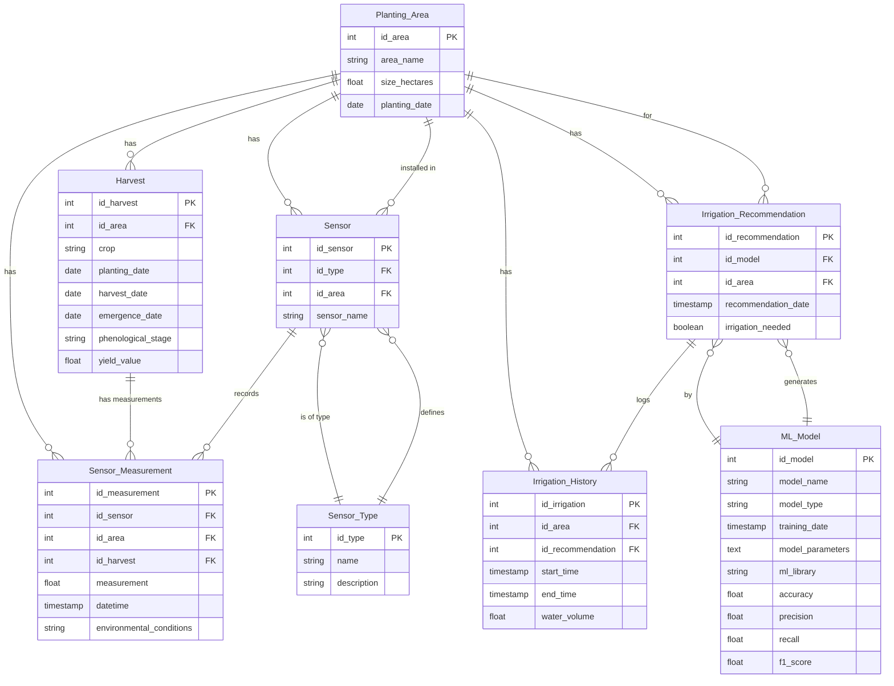

# Diagrama ER com Mermaid

Este documento contém um diagrama de entidade-relacionamento (ER) gerado usando a sintaxe do Mermaid.

O Mermaid é uma ferramenta que permite criar diagramas e gráficos de forma simples e rápida, utilizando uma linguagem de marcação semelhante ao Markdown. 

O Mermaid é suportado em várias plataformas, incluindo GitHub, GitLab, Bitbucket e Markdown Preview Enhanced. Portanto, o diagrama a seguir aparecerá corretamente quando visualizado em um desses ambientes.

Abaixo segue o diagrama ER gerado para o projeto Planting Area:

